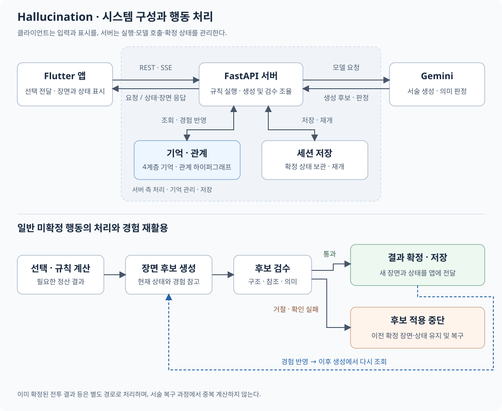

# Hallucination

**LLM 서사 생성 시스템의 환각 방지 아키텍처 설계 및 구현**

[최종보고서](docs/Hallucination_최종보고서.pdf) · [포스터](docs/Hallucination_포스터.pdf) · [소개 영상](https://youtu.be/-6wzJoiOipY)

## 1. 프로젝트 소개

### 배경 및 필요성

LLM이 만드는 이야기를 상태가 누적되는 게임에 적용하면 서술과 실제 체력·소유물·파티 명단 등의 상태가 어긋날 수 있다. Hallucination은 생성된 이야기와 프로그램이 확정하는 게임 상태의 책임을 나누고, 기억과 검수·복구를 연결하는 구조를 구현한 프로젝트이다.

### 목표 및 주요 내용

싱글 플레이어 텍스트 RPG를 적용 환경으로 사용한다. 플레이어는 Flutter 앱에서 장면을 읽고 선택하며, 서버는 필요한 게임 정산을 수행하고 후속 장면과 상태를 제공한다. 선택은 인물의 반응과 상황 변화로 이어지며, 함께 겪은 경험은 이후 장면을 생성할 때 다시 참고하는 맥락으로 남는다.

- 선택에 따라 수치나 소유물을 바꿔야 할 때는 연결된 실행 정보를 바탕으로 서버가 처리한다. 수치 변경이 없는 선택도 인물의 반응과 상황 변화로 이어질 수 있다.
- 4계층 기억과 관계 하이퍼그래프로 이전 경험을 후속 생성에 공급한다.
- 생성 후보의 구조·참조·상태 주장을 검수하고, 상태 확정과 실패 복구를 관리한다.
- 앱·서버·세션 저장을 연결하여 플레이를 이어갈 수 있도록 한다.

## 2. 상세 설계

### 시스템 구성

Flutter 앱은 REST·SSE로 FastAPI 서버와 통신한다. 서버가 게임 규칙 실행, 생성·검수, 기억·관계 조회와 세션 저장을 연결하고 Gemini 호출을 수행한다. 앱이 생성 문장을 근거로 게임 수치를 직접 변경하는 구조는 아니다.

그림 아래쪽은 행동 결과를 확정하기 전 검수하는 과정이다. 검수를 통과한 결과를 확정·저장하고 경험을 반영하며, 거절된 후보는 적용하지 않고 이전 확정 상태를 유지·복구한다. 축적된 경험은 이후 생성에서 다시 조회한다. 이미 확정된 전투 결과 등은 이 흐름과 구분하여 중복 계산하지 않는다.

### 기억과 관계의 설계

최근 대화의 구체적인 내용과 오래 보존할 경험은 필요한 형태와 수명이 다르므로 기억의 역할을 나누었다.

| 계층 | 보관하는 내용과 역할 |
|---|---|
| 감각 기억 | 최근 장면 원문으로 직전 대화와 행동의 세부를 유지 |
| 작업 기억 | 가까운 장면의 요약으로 현재 전개의 초점을 유지 |
| 일화 기억 | 중요한 사건과 출처를 보존하여 과거 경험을 다시 활용 |
| 의미 기억 | 지속적으로 참조할 정보와 근거를 장기간 보존 |

관계 하이퍼그래프는 여러 인물과 공동 사건의 연결을 관리하고 현재 인물과 함께 겪은 경험을 조회한다. 기억을 무조건 모두 입력하지 않고, 현재 맥락과 입력 예산에 맞게 선택하며 중복 공급을 줄인다. 과거 경험을 다시 활용할 수 있지만, 잘못된 요약도 반복해서 참조할 수 있다. 따라서 기억으로 저장할 내용을 검수하고, 다시 활용할 때도 현재 게임 상태를 근거로 삼아야 한다.

### 사용 기술

| 영역 | 기술 및 버전 |
|---|---|
| 모바일 클라이언트 | Flutter `3.32.6`, Dart `3.8.1` |
| 서버 | Python `3.13.12`, FastAPI `0.128.0` |
| 통신 | REST, SSE |
| 생성 모델 | Gemini 3.8 Flash / LOW — 9월 선택·상태·기억 평가 |
| 경험과 관계 | 4계층 기억, 관계 하이퍼그래프 |

기억 입력 비교와 검출기 평가에는 Gemini 3.5 Flash-Lite / MINIMAL을 사용하였다.

### 소스 구성

| 경로 | 주요 기능 |
|---|---|
| [src/choice_binding.py](src/choice_binding.py) | 선택 식별자에 대응하는 실행 정보 한 항목을 찾아 복사하여 반환 |
| [src/admission.py](src/admission.py) | 증거별 판정의 형식·누락·중복을 검사하고 거절 시 처리를 중단 |
| [src/memory_promotion.py](src/memory_promotion.py) | 조건에 맞는 작업 기억을 일화 기억에 추가하고 중복 승격을 방지 |
| [src/shared_experience.py](src/shared_experience.py) | 다자 관계를 표현하고 두 인물의 공동 사건을 중요도 순으로 조회 |

주요 구현을 발췌한 소스다. [코드 안내](src/SOURCE_GUIDE.md)에는 함수별 입력·출력과 다음 처리의 실제 원문을 함께 제시하였다.

- [수치 변경의 권한과 실제 적용](src/SOURCE_GUIDE.md#수치-변경의-권한과-실제-적용): 생성 응답의 필드 검사, 전투 HP·MP·골드의 실제 반영
- [시스템 수치로 구성하는 응답](src/SOURCE_GUIDE.md#시스템-수치로-구성하는-응답): 행동 전후 상태 비교, 정산 생성·기록, 응답 수치 전달
- [기억과 공동 경험의 생성 요청 연결](src/SOURCE_GUIDE.md#기억과-공동-경험의-생성-요청-연결): 기억 조회·선택과 생성 요청 입력의 연결
- [검수와 상태 반영의 호출 흐름](src/SOURCE_GUIDE.md#검수와-상태-반영의-호출-흐름): 후보·근거 구성, 판정 검사, 거절 시 처리 중단과 후속 상태 반영
- [실패 복구와 저장 후 응답](src/SOURCE_GUIDE.md#실패-복구와-저장-후-응답): 저장 전 실패의 상태 복원과 저장 완료 후 응답 전송

### 실제 동작과 평가 결과

플레이 과정에서 선택에 따른 서술과 실제 상태를 대조하고, 경험 전달과 저장·재개 동작을 검사하였다.

| 사례 | 동작과 결과 |
|---|---|
| 전투 계산과 서술 | 시스템이 피격과 처치, HP 105→94를 계산한 뒤, 장면은 피격·반격·처치와 체력 손실을 서술했다. |
| 서술 오류와 수치의 분리 | 필드 대기 후 서술은 마나 회복을 암시했지만 실제 MP는 11→11로 유지됐다. 오류 문장은 표시됐으나 수치는 그 서술대로 증가하지 않았다. |
| 파티 제안 수락 | 파티가 없던 리디아가 엘비라의 제안을 수락했다. 다음 장면의 결성 서술과 API의 2인 명단이 일치했고, 같은 결성 내용이 기억 요약으로 추출되었다. |
| 근거 없는 구매 완료 서술 | 구매 정산이 없는 행동에서 후보가 목궁 구매 완료를 서술했다. 해당 후보는 거절되어 표시되지 않았고, 소지금 100G·소유물·이전 확정 장면이 유지되었다. 요청한 구매는 완료되지 않았다. |
| 공유 경험의 재활용 | 메리와 트리톤의 파티 결성·이동 합의 요약이 이후 요청의 ‘트리톤과의 경험’으로 다시 공급되었고, 후속 장면에도 두 인물의 관계가 이어졌다. |
| 저장과 재개 | 분리 상태 로드 24회의 해시와 재개 응답 240개 필드가 저장 기준과 일치했다. |

파티 수락은 2026년 9월 10일 실행 사례이고, 공유 경험은 2026년 8월 1일 Gemini 3.1 Flash-Lite를 사용한 사례이다. 서로 다른 시기·조건의 사례이므로 전체 빌드의 성공률로 일반화할 수는 없다.

공유 경험 사례는 정보 전달을 확인한 것으로, 관계 검색만의 품질 향상은 따로 측정하지 않았다. 저장·재개 검사는 상태 복원을 대상으로 했으며 실제 기기 강제 종료나 서버 재시작은 포함하지 않았다.

### 비교 평가

장기 기억을 생성 입력에 제공한 FULL 조건과 제외한 M0 조건을 10쌍으로 비교하였다.

| 평가 항목 | FULL | M0 |
|---|---|---|
| 지연 회상 | 6/10 | 0/10 |
| 새 사실 반영 | 7/10 | 0/10 |
| 근거 없는 질문에 대한 추측 자제 | 10/20 | 10/20 |

회상과 새 사실 반영에서는 차이가 관측됐고, 추측 자제에서는 차이가 없었다. 전체 예정 80문항 중 결과·판정이 없는 20문항도 분모에 포함했다.

별도의 검출기 평가는 490개 표시 단위를 대상으로 하였다. 표집 가중치를 적용한 정밀도는 **45.71%**, 재현율은 **32.34%**, F1은 **37.88%**, 위양성률은 **0.40%**였다.

두 평가는 독립적인 인간 정답 대신 LLM 판정을 기준으로 하였다. 기억 비교에는 조건별 진행 차이가 있어 결과를 탐색적으로 해석해야 하며, 각 기억 계층의 효과나 최적성은 평가하지 않았다.

의미 검수에는 오탐·미탐이 남았고 수용된 서술에서도 오류가 관측되었다. 검출기 지표는 최종 출력 전체의 정확도나 환각 감소율을 뜻하지 않는다. 사례별 조건과 평가 방법은 [최종보고서](docs/Hallucination_최종보고서.pdf) 제3·4장에 설명하였다.

### 프로젝트 문서

| 문서 | 내용 |
|---|---|
| [착수보고서](docs/Hallucination_착수보고서.pdf) | 착수 시점의 목표와 계획 |
| [중간보고서](docs/Hallucination_중간보고서.pdf) | 중간 시점의 구현과 진행 기록 |
| [최종보고서](docs/Hallucination_최종보고서.pdf) | 최종 설계·구현·평가와 한계 |
| [포스터](docs/Hallucination_포스터.pdf) | 작품의 주요 내용을 정리한 소개 자료 |

## 3. 설치 및 사용 방법

### 이용 환경

작품은 개발팀이 준비한 Flutter 앱과 서버 실행 환경에서 이용한다. 공개 다운로드 파일이나 외부 접속 주소는 제공하지 않는다. 이 저장소의 소스는 주요 구현 발췌이며, 저장소만 내려받아 작품을 설치·실행하는 패키지는 아니다. 아래는 준비된 앱에서의 이용 순서이다.

### 기본 이용 흐름

1. 준비된 Flutter 앱에서 새 세션을 시작하거나 저장된 세션을 재개한다.
2. 게임 화면의 장면과 대화를 읽고 선택을 확정한다.
3. 서버 처리가 끝나면 표시되는 후속 장면과 상태를 확인한다.
4. 캐릭터·아이템·장비·관계 화면에서 현재 상태를 살펴보고, 장면으로 돌아와 다음 선택을 이어간다.

## 4. 소개 및 시연 영상

[Hallucination 졸업과제 소개 동영상 보기](https://youtu.be/-6wzJoiOipY)

## 5. 팀 소개

| 이름 | 담당 | 연락처 |
|---|---|---|
| 박찬오 | 코어 아키텍처, 게임 상태 관리, 최종 통합 | [opark001@pusan.ac.kr](mailto:opark001@pusan.ac.kr) |
| 김동현 | Flutter 모바일 클라이언트, 서버 통신 | [sua3801@pusan.ac.kr](mailto:sua3801@pusan.ac.kr) |
| 신승훈 | AI 생성, 일관성 검증 및 평가 | [uitopia04@pusan.ac.kr](mailto:uitopia04@pusan.ac.kr) |
